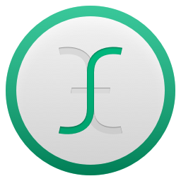

# cpSublimeTextIcon

## About
A custom icon for Sublime Text. The design plays off the image of an I-bar (text) cursor, reimagining it as a distorted ‘st’ ligature. It is available in both light and dark flavours, and is optimised for 512, 256, 128, 32 and 16-pixel sizes (including 2x versions for Retina displays).

Original design by [Cole Peters](http://github.com/colepeters). Feel free to fork or make pull requests!

## Installation
1. Clone or download this repository's master branch to your computer.
2. In the <code>/icns</code> directory, locate either the dark or light <code>.icns</code> file.
3. In a new finder window, navigate to your <code>/Applications</code> directory, click on Sublime Text, and type <code>ctrl-i</code> (or right-click and choose Get Info).
4. Drag the <code>.icns</code> file overtop of the Sublime Text icon in the Info panel. You will see the icon change. Close the Info panel.
5. Right-click on your Sublime Text application icon and choose Show Package Contents.
6. Navigate to <code>/Contents/Resources</code>, and copy the <code>.icns</code> file to this directory.
7. Rename it to <code>Sublime Text 2.icns</code> or <code>Sublime Text.icns</code>, depending on your version of the app.
8. You're done! If you don't see the icon update in your dock, open Terminal and run <code>killall Dock</code> to relaunch it.

## Notes
This repository includes the following:
- Master <code>.sketch</code> file with each icon size on its own artboard (one page for Light, one page for Dark)
- <code>.icns</code> files for Light and Dark colourways
- Icon Slate project file (for converting <code>.png</code> files to <code>.icns</code> files

You will need the [Sketch beta](http://www.bohemiancoding.com/sketch/beta/) (v2.3.2 build 5137 or later)to edit the master file. Icon Slate is available for [download on the App Store](https://itunes.apple.com/gb/app/icon-slate/id439697913?mt=12), or you can use another converter of your choice (preferably one that includes options for including 2x assets for Retina displays).

## Version notes

2.0: Same concept, new design.

1.2: Reduced the height of the I-bar. Added some extra weight to the 128pt icon to aid with clarity when displayed in the Dock. Darkened the dark icon a bit.

1.1: Converted the tile from a rounded rectangle to a circle — more OSX friendly. Some subtle colour adjustments. Also added an outline to the light 16pt icon to aid visibility within OSX's list view.

1.0.1: Converted the “st” type for 16pt icons to outlines

1.0: First release!